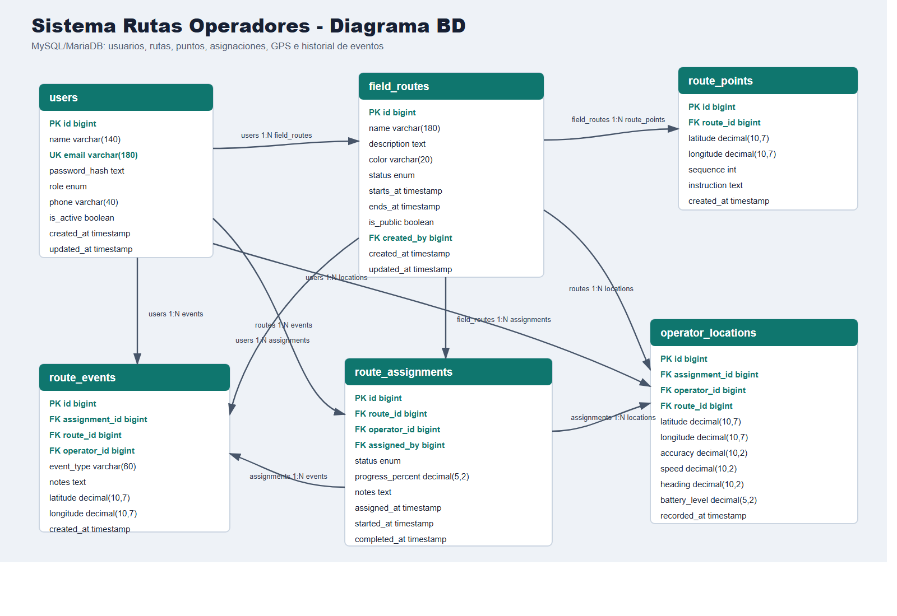

# Sistema Rutas Operadores

Sistema web independiente para crear rutas en mapa, asignarlas a operadores de campo, capturar GPS desde movil y publicar el avance en una pantalla ciudadana sin datos sensibles.

Este proyecto no depende del sistema de clandestinos. Vive en su propia carpeta, con frontend y backend separados.

## Stack

- Frontend: React + Vite
- Backend: Node.js + Express
- Base de datos: MySQL/MariaDB
- Mapa: Leaflet + OpenStreetMap
- Tiempo real: Socket.IO
- Autenticacion: JWT con roles `administrador`, `supervisor`, `operador` y `publico`
- Despliegue: preparado para Railway con variables de entorno

## Estructura

```text
sistema-rutas-operadores/
  backend/
    sql/schema.sql
    src/
      routes/
      middleware/
      app.js
      server.js
  frontend/
    src/
      components/
      App.jsx
      styles.css
  railway.json
  package.json
```

## Diagrama de base de datos



Archivos disponibles:

- `docs/diagrama-bd.png`: imagen local del diagrama.
- `docs/diagrama-bd.svg`: version editable como imagen vectorial.
- `docs/diagrama-bd.mmd`: fuente Mermaid para documentacion.
- `docs/diagrama-bd.html`: visor HTML del diagrama Mermaid.

## Funcionalidades incluidas

- Login con roles.
- Administrador/supervisor:
  - crear rutas trazando puntos sobre el mapa,
  - guardar rutas por barrio o colonia,
  - agregar marcadores de referencia sobre la ruta,
  - listar rutas,
  - asignar rutas a operadores,
  - nombrar el vehiculo visible en el mapa,
  - programar operadores por dia de lunes a domingo,
  - registrar usuarios de operador,
  - monitorear ubicaciones GPS en tiempo real,
  - ver el carrito del operador y el rastro recorrido,
  - ver vehiculos asignados en tarjetas operativas,
  - simular un recorrido para demostraciones,
  - ver resumen e historial por ruta,
  - eliminar rutas desde el panel administrativo.
- Operador:
  - ver rutas asignadas,
  - ver el mapa de su ruta desde el celular,
  - iniciar captura GPS desde dispositivo movil,
  - reportar ubicacion GPS,
  - calcular avance segun la ruta trazada,
  - recibir aviso si se desvia de la ruta,
  - guardar ubicaciones en el navegador si no hay internet y sincronizarlas al volver la conexion,
  - finalizar ruta.
- Alertas:
  - el backend compara cada ubicacion contra la linea oficial de la ruta,
  - registra evento `route_deviation` si el operador supera `DEVIATION_WARNING_METERS`,
  - muestra alertas en el monitoreo interno sin publicarlas en la pantalla ciudadana,
  - avisa al operador en su pantalla movil si se sale de la ruta.
- Pantalla publica:
  - acceso en `/public`,
  - muestra solo rutas marcadas como publicas,
  - oculta correo, telefono y datos internos,
  - usa mapa urbano de mayor nitidez,
  - muestra un mapa general y hasta 5 paneles simultaneos,
  - actualiza por Socket.IO y por respaldo cada 30 segundos.

## Configuracion local

1. Crear base MySQL/MariaDB:

```bash
mysql -u root -p -e "create database if not exists sistema_rutas_operadores character set utf8mb4 collate utf8mb4_unicode_ci;"
```

2. Ejecutar el esquema:

```bash
mysql -u root -p sistema_rutas_operadores < backend/sql/schema.sql
```

3. Crear archivos de entorno:

```bash
cp backend/.env.example backend/.env
cp frontend/.env.example frontend/.env
```

4. Ajustar `backend/.env`:

```env
PORT=4001
DB_HOST=127.0.0.1
DB_PORT=3307
DB_USER=root
DB_PASSWORD=root
DB_NAME=sistema_rutas_operadores
JWT_SECRET=cambiar_este_secreto_en_produccion
FRONTEND_URL=http://localhost:5174
DEVIATION_WARNING_METERS=80
```

5. Instalar dependencias:

```bash
npm run install:all
```

6. Crear usuarios iniciales:

```bash
npm run db:seed
```

Usuarios de prueba:

```text
admin@rutas.local / Rutas123
supervisor@rutas.local / Rutas123
operador@rutas.local / Rutas123
publico@rutas.local / Rutas123
```

7. Iniciar backend y frontend en dos terminales:

```bash
npm run dev:backend
npm run dev:frontend
```

URLs:

```text
Frontend: http://localhost:5174
Pantalla publica: http://localhost:5174/public
Backend: http://localhost:4001
Health: http://localhost:4001/health
```

## Como ver el carrito en movimiento

Modo real:

1. Entrar como administrador y crear una ruta con varios puntos.
2. Escribir el barrio o colonia.
3. Usar `Agregar marcador` para guardar referencias como inicio, parada, punto critico o fin.
4. Asignar la ruta al operador.
5. Escribir el nombre del vehiculo, por ejemplo `Unidad Azul 07`.
6. Seleccionar el dia de operacion: lunes, martes, miercoles, jueves, viernes, sabado o domingo.
7. Entrar desde un celular como `operador@rutas.local`.
8. El operador vera solo sus rutas asignadas y podra abrir el mapa de la ruta.
9. Presionar `Iniciar seguimiento` y aceptar permisos de ubicacion.
10. En el panel de administrador se vera la linea oficial, los marcadores, el carrito y el rastro punteado del recorrido.
11. En la pantalla publica se vera un solo carrito por ruta/operador, no un carrito por cada punto GPS.

Modo demo:

1. Entrar como administrador.
2. Ir a `Historial`.
3. Presionar `Simular recorrido` en una asignacion.
4. El sistema enviara ubicaciones de prueba sobre la ruta para ver el carrito moverse.

## Despliegue en Railway

### Backend

Crear un servicio desde esta carpeta o desde el repositorio usando root directory `sistema-rutas-operadores`.

Variables:

```env
NODE_ENV=production
DB_HOST=${{MySQL.MYSQLHOST}}
DB_PORT=${{MySQL.MYSQLPORT}}
DB_USER=${{MySQL.MYSQLUSER}}
DB_PASSWORD=${{MySQL.MYSQLPASSWORD}}
DB_NAME=${{MySQL.MYSQLDATABASE}}
JWT_SECRET=un_secreto_largo_y_privado
JWT_EXPIRES_IN=8h
FRONTEND_URL=https://tu-frontend.railway.app
```

Comando de inicio:

```bash
npm --prefix backend start
```

Ejecutar `backend/sql/schema.sql` en la base MySQL de Railway y luego el seed si se desean usuarios iniciales.

### Frontend

Crear otro servicio con root directory `sistema-rutas-operadores/frontend`.

Variables:

```env
VITE_API_URL=https://tu-backend.railway.app
```

Comandos:

```bash
npm install
npm run build
```

Directorio de salida:

```text
dist
```

## Notas de seguridad

- Cambiar `JWT_SECRET` antes de produccion.
- Cambiar las contrasenas creadas por el seed.
- La pantalla publica usa `/api/public/routes` y no entrega correos, telefonos ni identificadores internos de usuarios.
- La app queda lista para integrarse mas adelante con el sistema de clandestinos mediante enlaces o API, sin dependencia directa.
